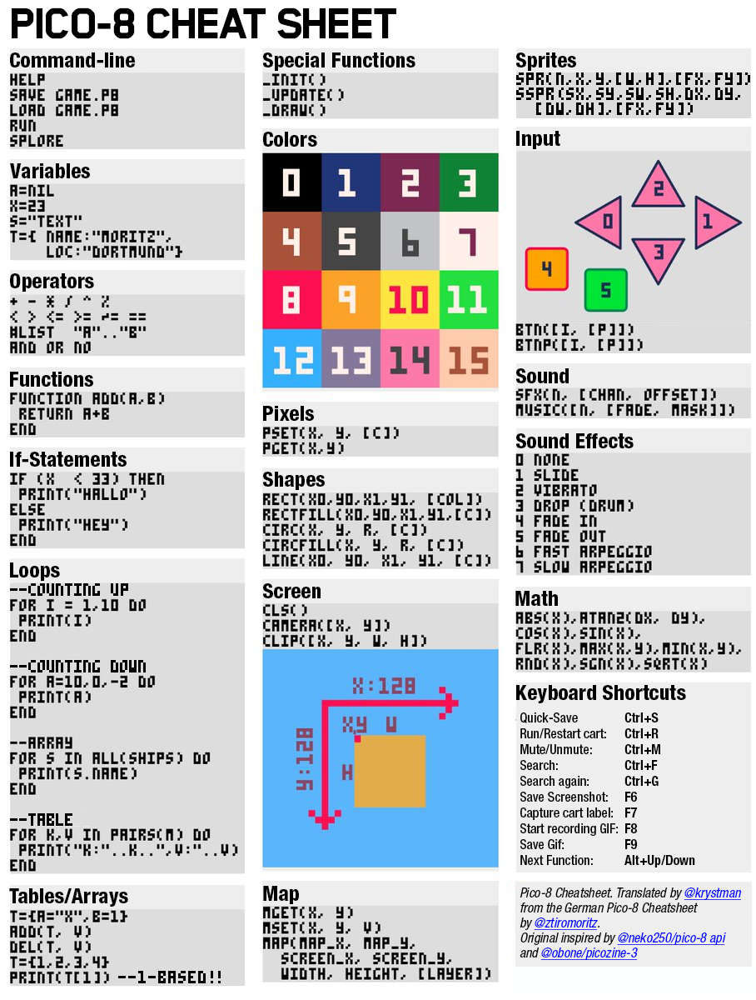
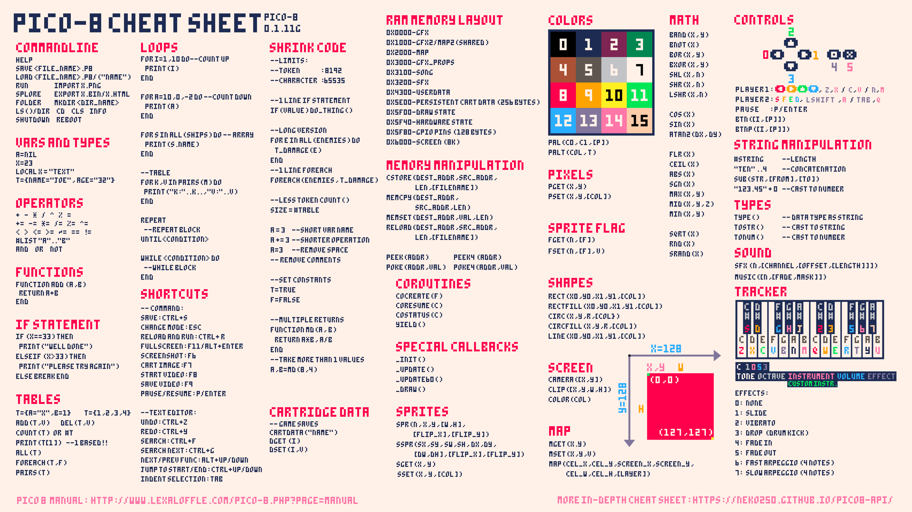

# Breakout Pico-8 Hero

This repository serves as a companion to the [TeamworkCast](https://www.youtube.com/@TeamworkCast) or [Lazy Devs](https://www.youtube.com/@LazyDevs) tutorial playlist on building games from scratch, in this case the Breakout game and for complete beginners.

PS.: I'll be incorporating insights from what I've learned in the videos into this repository. I hope it proves helpful to you as well! 
Feel free to sugest any modification or improvements in the repository!

Reference: [Tutorial](https://youtube.com/playlist?list=PLea8cjCua_P0qjjiG8G5FBgqwpqMU7rBk&si=QSzfSuZvIDRNSmiD) 

**Older PICO-8 cheat sheet:**

**Newer PICO-8 cheat sheet:** 

## Tutorial Insights

- [Episode 1](./docs/tutorials/Breakout%20%231%20-%20Hello%20World%20-%20Pico-8%20Hero.md)
- [Episode 2](./docs/tutorials/Breakout%20%232%20-%20Functions%20and%20Variables%20-%20Pico-8%20Hero.md)
